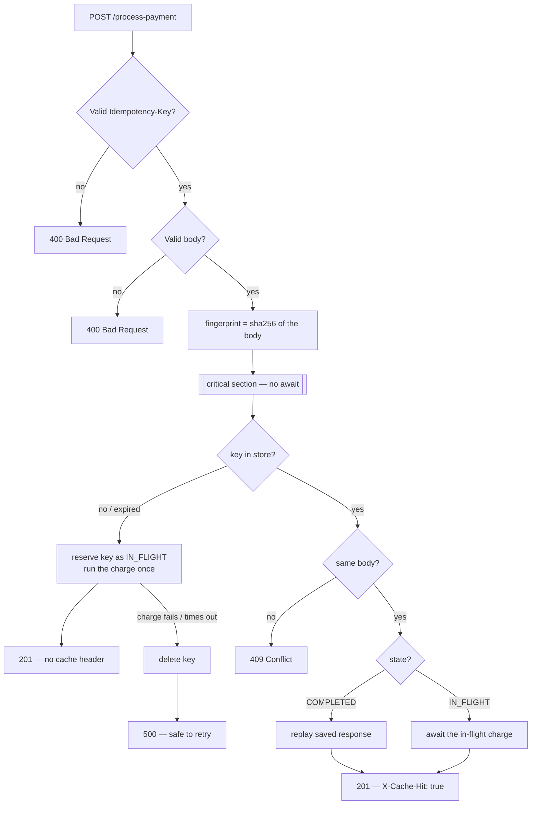
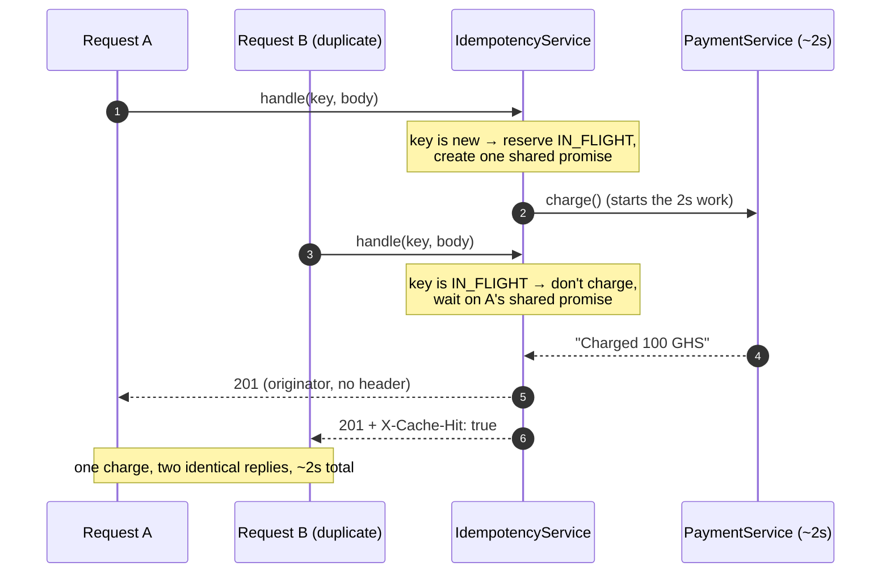

# Idempotency-Gateway

> A small NestJS service that makes a payment endpoint **safe to retry**. Send the same request ten times and the customer is charged **once** — every later attempt gets the original answer back, instantly.

Built for the FinSafe "Pay-Once" brief: clients hit network timeouts, retry their `POST`, and without protection the customer is billed twice. This gateway puts an idempotency layer in front of the charge so duplicates are recognised and replayed instead of re-run.

---

## Table of contents

- [The idea in one minute](#the-idea-in-one-minute)
- [Architecture](#architecture)
- [Running it](#running-it)
- [API](#api)
- [How the four cases are handled](#how-the-four-cases-are-handled)
- [Design decisions](#design-decisions)
- [Developer's Choice: key expiry (TTL)](#developers-choice-key-expiry-ttl)
- [Tests](#tests)
- [Limitations & what production would add](#limitations--what-production-would-add)

---

## The idea in one minute

Every request carries an `Idempotency-Key` header. The server keeps one **record** per key in memory:

- **First time it sees a key** → it runs the charge, saves the response, and returns it.
- **Sees the key again with the same body** → it returns the saved response and never touches the payment processor. The reply is marked `X-Cache-Hit: true`.
- **Sees the key with a *different* body** → it refuses with `409`, because reusing a key for a new charge is almost always a client bug or something worse.
- **Sees the key while the first charge is still running** → it *waits* for that charge to finish and returns its result, rather than starting a second one.

That last case — two identical requests arriving at the same instant — is the interesting one, and it's handled without locks (more below).

---

## Architecture

**The decision, as a flowchart:**



**Two identical requests racing each other:**



The whole contract lives in one file — [src/idempotency/idempotency.service.ts](src/idempotency/idempotency.service.ts) — backed by a single in-memory `Map`. The controller ([src/payment/payment.controller.ts](src/payment/payment.controller.ts)) just validates input and translates the result into HTTP.

---

## Running it

**Requirements:** Node ≥ 20 (developed on v25).

```bash
npm install
npm start          # builds, then serves on http://localhost:3000
```

`npm start` runs a build first (`prestart`), so a fresh clone boots with no extra steps. For an auto-reloading dev loop use `npm run start:dev`.

**Quick smoke test:**

```bash
curl -i -X POST http://localhost:3000/process-payment \
  -H 'Idempotency-Key: demo-1' \
  -H 'Content-Type: application/json' \
  -d '{"amount":100,"currency":"GHS"}'
```

Run it twice — the second response comes back immediately with an `X-Cache-Hit: true` header.

**Configuration** (all optional, via env vars):

| Variable | Default | Purpose |
|---|---|---|
| `PORT` | `3000` | HTTP port |
| `PROCESSING_DELAY_MS` | `2000` | Simulated charge duration |
| `IDEMPOTENCY_TTL_MS` | `86400000` (24h) | How long a key stays valid |
| `SWEEP_INTERVAL_MS` | `60000` | How often expired keys are swept |
| `IN_FLIGHT_TIMEOUT_MS` | `30000` | Max time a charge may run before it's force-failed |

---

## API

### `POST /process-payment`

**Headers**

| Header | Required | Notes |
|---|---|---|
| `Idempotency-Key` | yes | Any unique string ≤ 255 chars. Trimmed; leading/trailing spaces don't create a new key. |
| `Content-Type` | yes | `application/json` |

**Body**

```json
{ "amount": 100, "currency": "GHS" }
```

`amount` must be a positive number; `currency` must be a 3-letter uppercase code.

**Responses**

| Situation | Status | Body | Headers |
|---|---|---|---|
| First request | `201` | `{ "status": "Charged 100 GHS", "amount": 100, "currency": "GHS" }` | — |
| Duplicate (same body) | `201` | identical to the first | `X-Cache-Hit: true` |
| Same key, different body | `409` | `{ "message": "Idempotency key already used for a different request body." }` | — |
| Missing/blank/oversized key, or invalid body | `400` | validation error | — |
| Charge failed | `500` | error (the key is released, so a retry runs cleanly) | — |

---

## How the four cases are handled

**1 — First request.** No record exists, so the service reserves the key (marking it `IN_FLIGHT`), runs the charge, stores the response, and returns it.

**2 — Duplicate.** A record exists and is `COMPLETED`, so the saved response is returned verbatim with `X-Cache-Hit: true`. The payment processor is never called.

**3 — Different body, same key.** Bodies are compared by a **SHA-256 fingerprint** of their canonical form. If the incoming fingerprint doesn't match the stored one, it's a `409`. (See [body-fingerprint.util.ts](src/idempotency/body-fingerprint.util.ts) — key order and Unicode encoding are normalised, so `{a,b}` and `{b,a}` are treated as the same body.)

**4 — The race (bonus).** When the first request reserves a key, it also creates a single **shared promise** and stores it on the record. A duplicate that arrives mid-charge sees the `IN_FLIGHT` state and simply `await`s that promise — so it returns the *same* result without starting a second charge. Because Node runs JavaScript on one thread, the "look up the key → reserve it" step is a single uninterruptible block of synchronous code, which is what makes this safe **without any lock**.

---

## Design decisions

**One Map, one service.** The brief allows an in-memory store, and a single `Map` keyed by the idempotency key is the most honest implementation of the requirement. No Redis to stand up, no schema — `npm start` just works. The trade-offs that come with that choice are listed under [Limitations](#limitations--what-production-would-add).

**No locks for the race.** A mutex would mean adding an `await` before writing to the Map, which actually *widens* the window for a double-reserve. Relying on Node's run-to-completion guarantee instead means the critical section is the few synchronous lines between reading and writing the key — nothing can interleave there. The shared promise then fans the single result out to every waiter.

**Fingerprint the body, don't store it.** Keeping a 64-character hash rather than the raw payment body means the comparison is constant-size and we don't sit on payment data just to detect duplicates. SHA-256 (not a fast non-crypto hash) because a collision here would let a *different* charge masquerade as a replay.

**A failed charge is never cached.** If the charge throws (or runs too long), the key is **deleted** rather than stored. Caching a failure as `COMPLETED` would replay a fake "success" forever; leaving it `IN_FLIGHT` would deadlock every retry. Deleting it gives clean semantics: exactly-once on success, retryable on failure.

**409 vs 400.** A body that isn't a valid payment (missing fields, wrong types, extra fields) is a `400` — it never gets far enough to be compared. `409` is reserved for the specific case the brief calls out: a *valid* body whose amount or currency differs from what the key first saw.

---

## Developer's Choice: key expiry (TTL)

**What I added:** every idempotency key expires **24 hours after it's first used** (configurable). Expiry is enforced two ways — lazily, the moment an expired key is looked up, and by a low-priority background sweep that clears them out.

**Why it matters for a real payments company:**

- **Memory doesn't grow forever.** Without expiry, the Map only ever grows. Every key a client ever sent would live in RAM until the process restarted — a slow leak and an availability risk.
- **It matches how clients actually think.** This mirrors Stripe's behaviour: a key is good for a day, then it's gone. A retry of a *week-old* request shouldn't silently replay an ancient charge — it should be treated as new. The window is fixed from first use and doesn't slide, so a busy key can't be kept alive indefinitely by duplicates.
- **It bounds an attacker's footprint.** Combined with the 255-char key limit, expiry caps how much memory a flood of unique keys can pin.

**The subtle part — never evict a live request.** A key that's still `IN_FLIGHT`, or that has callers waiting on it, is *not* evictable even if it's technically past its TTL. Dropping such a record could let a concurrent duplicate reserve the key a second time and double-charge — exactly what this whole service exists to prevent. To make sure an expired-but-hung charge can't pin a key forever, a **watchdog** force-fails any charge that runs past `IN_FLIGHT_TIMEOUT_MS`, which releases the key.

---

## Tests

```bash
npm test        # unit tests (service logic, race, TTL, fingerprinting, key pipe)
npm run test:e2e   # full HTTP tests via supertest (all four user stories + validation + TTL)
```

The concurrency tests don't rely on real time — they hold a charge "in flight" with a controllable promise and assert that a second request coalesces onto it. The TTL and watchdog tests use Jest's fake timers, so the whole suite runs in a couple of seconds with no flaky sleeps.

---

## Limitations & what production would add

This is a deliberately scoped exercise. Being honest about the edges:

- **In-memory = single process, volatile.** A restart forgets every key, and two instances behind a load balancer wouldn't share state — so the guarantee would break when scaled out. The fix is to move the same record shape into Redis or Postgres and replace the synchronous critical section with an atomic `SET NX` / row lock. The rest of the logic is unchanged.
- **Failures aren't negatively cached.** A request that fails every time re-runs the charge each time. That's the right call for transient infrastructure errors (you *want* the retry), but a real processor would also cache a terminal decline so a blind retry can't later "succeed".
- **The charge is simulated.** `PaymentService` just waits and returns success; it doesn't model a real card decline. The delete-on-failure policy is correct for the infrastructure errors it does model.

---

Built with NestJS + TypeScript. Licensed under MIT (see [LICENSE](LICENSE)).
