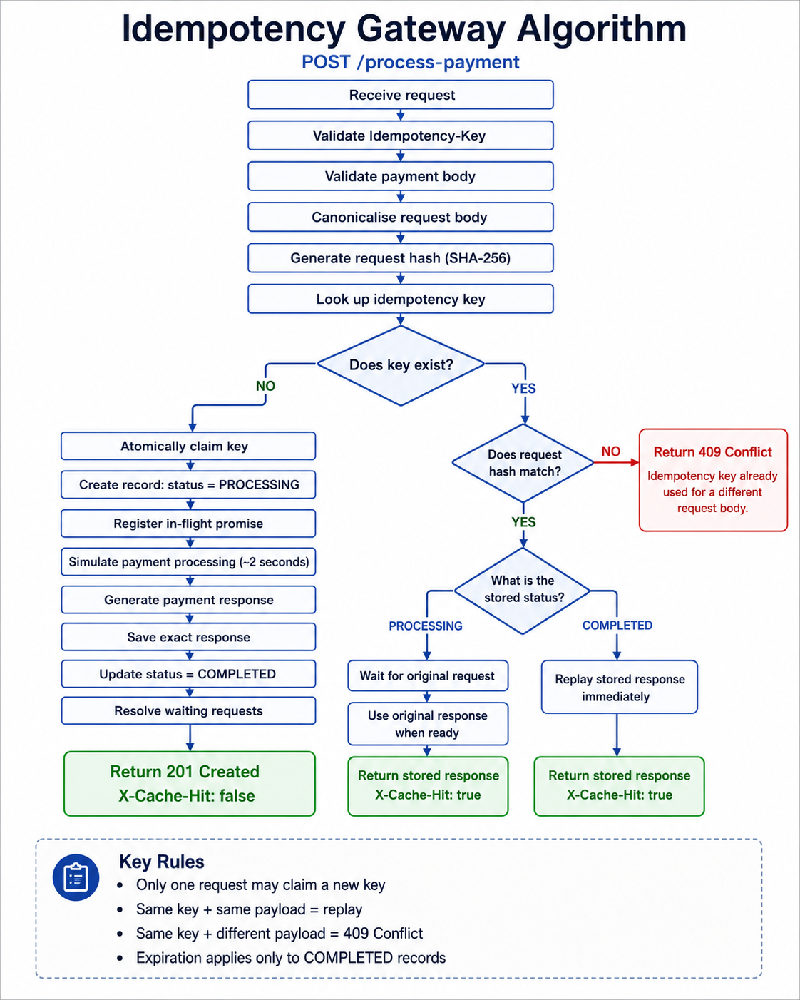

# Idempotency Algorithm

This flow ensures that retries share one payment execution while key reuse with a different payment is rejected.

1. Parse JSON and validate the single `Idempotency-Key`, positive finite `amount`, and three-letter uppercase `currency`.
2. Canonicalize the validated payment by recursively sorting object keys, then compute its SHA-256 hash.
3. Look up the key. A different stored hash returns `409`; a matching `COMPLETED` record replays its snapshot; a matching `PROCESSING` record waits for its in-flight Promise.
4. If no record exists, synchronously claim the key by inserting a `PROCESSING` record. If another caller won the claim, handle its record using step 3.
5. Publish the owner's Promise before yielding, then run the payment simulator.
6. On success, clone the response, store its `201` status and body snapshot, and replace the record with `COMPLETED`.
7. Resolve the owner with `X-Cache-Hit: false`; identical waiters receive isolated copies with `X-Cache-Hit: true`.
8. On failure, release only the matching `PROCESSING` claim, reject the owner and waiters, and allow a later request to retry.
