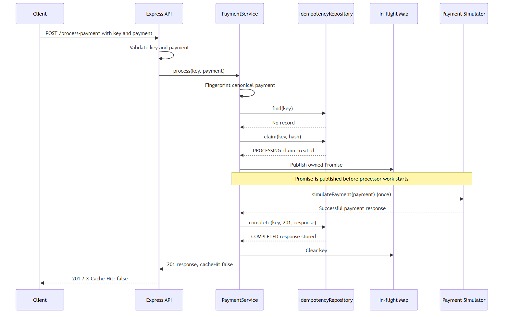
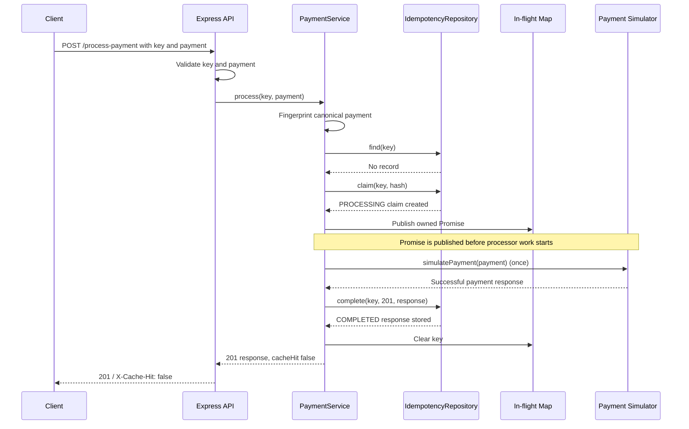
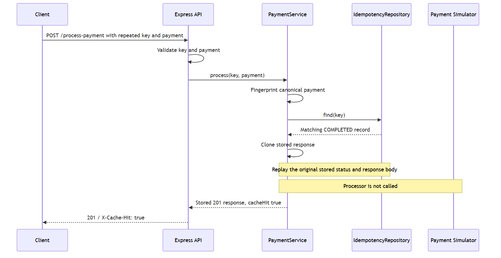
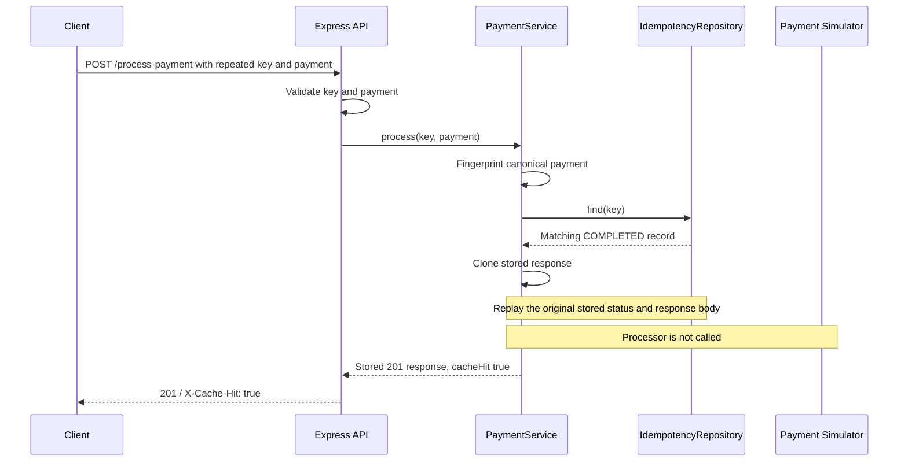
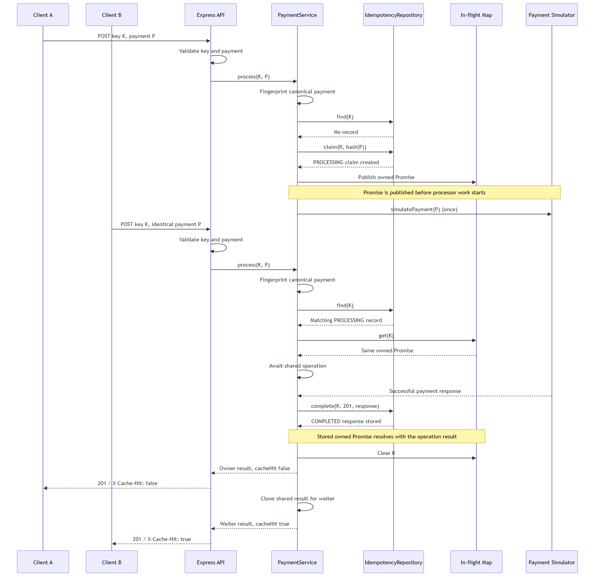
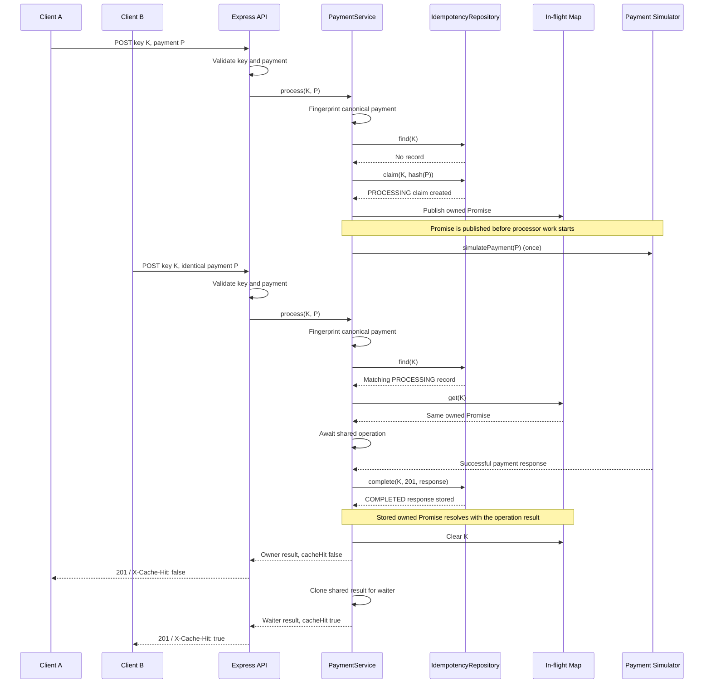
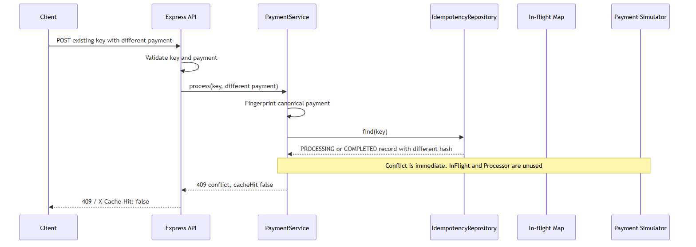
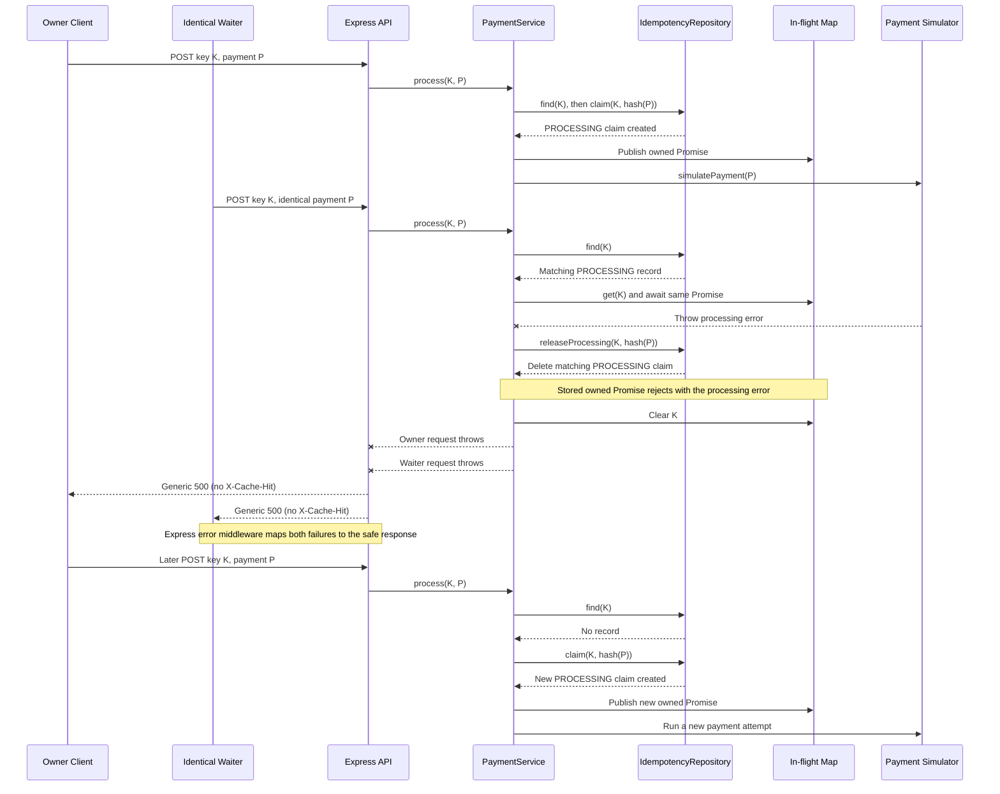

# Payment Request Sequence Diagrams

These diagrams show how the Express API, payment service, repository, in-flight operation map, and payment simulator collaborate for the gateway's five principal request paths. The Mermaid blocks are the editable sources; each section also links to its rendered PNG fallback.

## First Request

[](../diagrams/sequence-first-request.png)



## Completed Response Replay

[](../diagrams/sequence-completed-replay.png)



## Concurrent Identical Requests

[](../diagrams/sequence-concurrent-requests.png)



## Same Key with a Different Payment

[](../diagrams/sequence-payload-conflict.png)

```mermaid
sequenceDiagram
    participant Client
    participant API as Express API
    participant Service as PaymentService
    participant Repo as IdempotencyRepository
    participant InFlight as In-flight Map
    participant Processor as Payment Simulator

    Client->>API: POST existing key with different payment
    API->>API: Validate key and payment
    API->>Service: process(key, different payment)
    Service->>Service: Fingerprint canonical payment
    Service->>Repo: find(key)
    Repo-->>Service: PROCESSING or COMPLETED record with different hash
    Note over Service,Processor: Conflict is immediate; InFlight and Processor are unused
    Service-->>API: 409 conflict, cacheHit false
    API-->>Client: 409 / X-Cache-Hit: false
```

## Processing Failure and Later Retry

[](../diagrams/sequence-failure-retry.png)


