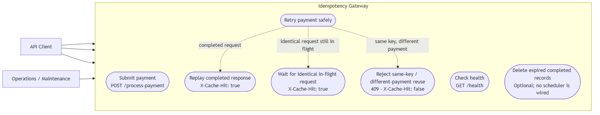
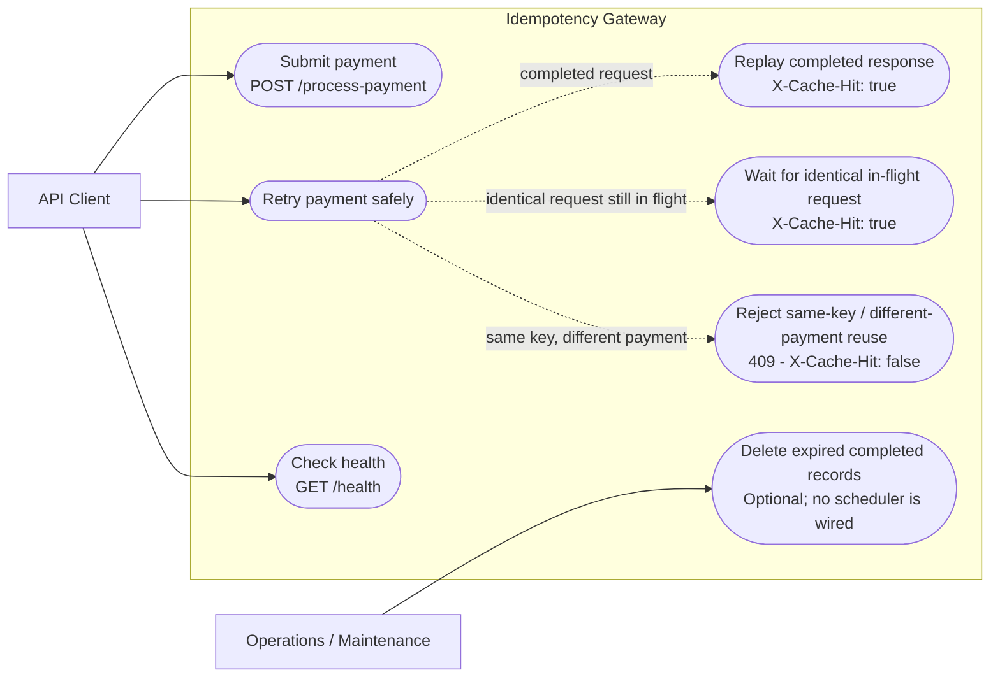

# Idempotency Gateway Use Cases

This diagram describes the gateway's externally visible payment, retry, health, and optional maintenance behavior. It distinguishes client actions from the outcomes selected by the gateway for an idempotent retry; it does not imply a scheduled cleanup process.

The Mermaid source below is the editable version of the diagram.

